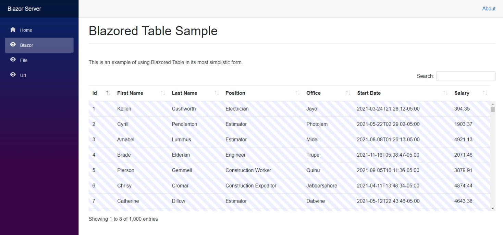

# Blazored Table

A powerful and customizable [DataTables.net](https://datatables.net) implementation for [Blazor](https://blazor.net) applications.

[](https://github.com/ennerperez/Blazored-Table/actions?query=workflow%3A%22Build+%26+Test+Main%22)
[](https://www.nuget.org/packages/Blazored.Table/)



## Getting Setup

You can install the package via the nuget package manager just search for *Blazored.Table*. You can also install via powershell using the following command.

```powershell
Install-Package Blazored.Table
```

Or via the dotnet CLI.

```bash
dotnet add package Blazored.Table
```